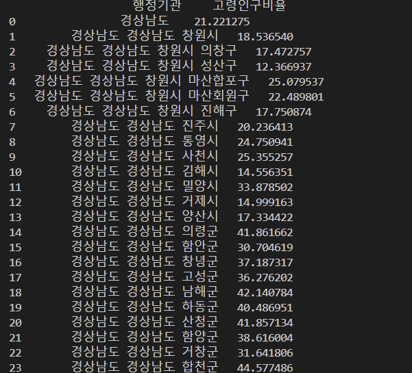

# TourismDataAnalysis
## "고령화 마을의 새로운 숨결: 촌캉스 문화공간으로 재탄생”

출품작 요약 
: 고령화가 심화되고 있는 지역에서 폐건물을 리모델링하여 복합 문화·상업 공간으로 조성 및 이를 새로운 촌캉스(시골에서 즐기는 휴가) 테마의 관광자원으로 활용. 이를 통해 지역 관광 활성화와 노인 일자리 창출을 동시에 달성.

1. 경상남도 고령 인구/전체 인구 비율 구하기 & 시각화
   분석에 사용한 데이터 : 202406_경상남도_고령인구비율.xlsx
   '행정기관', '고령인구비율’만 남기고 드랍해서 만든 데이터 : 경상남도_정리된_데이터.csv
경상남도 고령 인구 대비 전체 인구 비율.png

